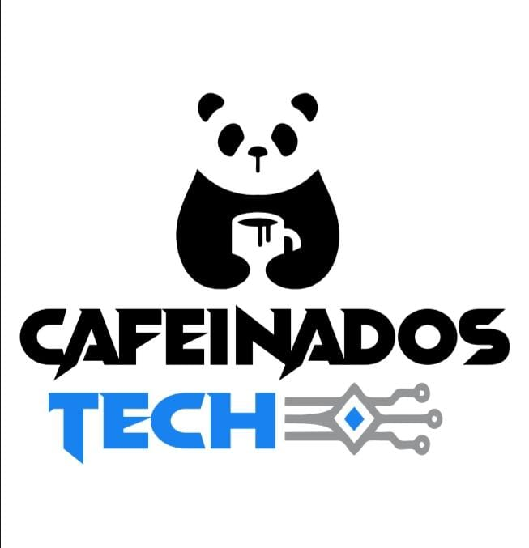

# CAFEINADOSTECH - DESAFIO COM BRANCHS 


</br></br>

## DEVS
### Assis - BACKEND - JAVA
* [GitHub](https://github.com/AssisCaetano)
### Jonathan - FRONTEND - JAVASCRIPT
* [GitHub](https://github.com/JonathanPacheco09)
### Débora - FULLSTACK - JAVASCRIPT
* [GitHub](https://github.com/deboradlss)

</br></br>

## Sobre o desafio
Desafio nomeado de "buguei.com". O desafio tem como objetivo de criar 3 servidores, um para cada desenvolvedor. Logo após, cada desenvolvedor deveria criar um arquivo com seu nome, subir para o github e em seguida fazer um merge dos três arquivos, para no final totalizar apenas um, nomeado de "Elite".


## Arquitetura do projeto


## Chave ssh para acesso na aws
```bash
   ssh -i "debora.pem" ubuntu@ec2-XX-XXX-XXX-XXX compute-1.amazonaws.com
```